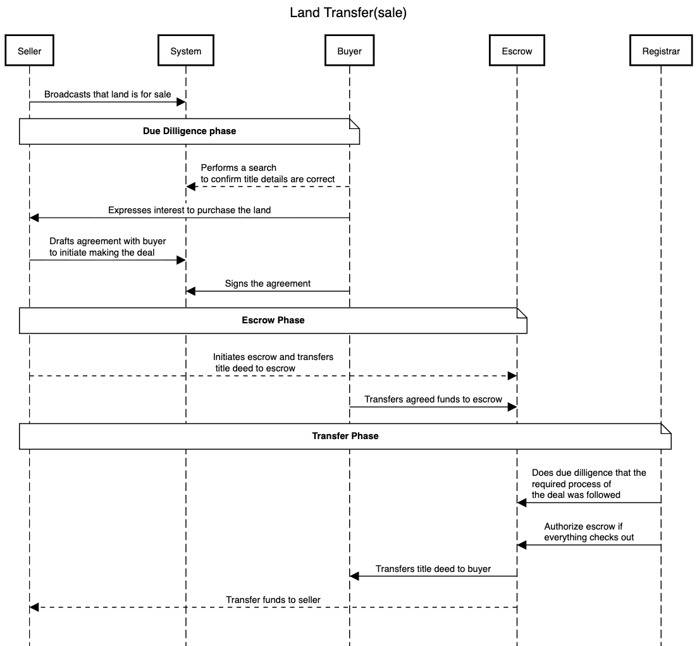
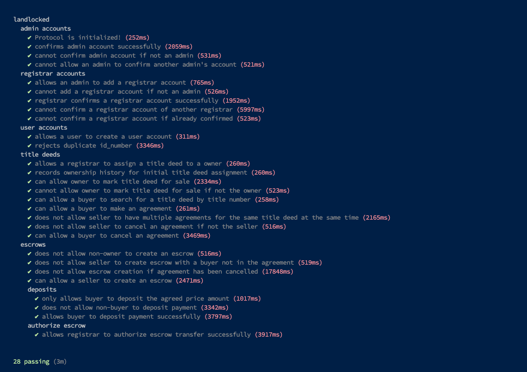

# LandLocked 🔒

A decentralized land registry system built on Solana blockchain that enables secure, transparent, and immutable tracking of land ownership and transfers.

## Overview

LandLocked is a Solana program that digitizes land registry processes, providing a trustless system for:
- **Land Title Management**: Register and track land titles with immutable ownership records
- **Secure Transfers**: Facilitate land sales through escrow-based transactions
- **Ownership History**: Maintain a complete audit trail of all ownership transfers
- **Registrar Oversight**: Enable authorized registrars to validate and authorize land transfers.

## Key Features

### 🏛️ Land Registry Management
- **Title Deed Registration**: Register land titles with detailed information (location, acreage, district, mapsheet number)
- **Title Number Lookup**: Search for land titles by title number
- **Ownership Tracking**: Track current and historical ownership of land parcels

### Escrow-Based Land Sales
- **Secure Transactions**: Sellers can create escrows to hold title deeds during sale
- **Payment Deposits**: Buyers deposit funds into escrow accounts
- **Registrar Authorization**: Authorized registrars validate and complete transfers marking the process as legitimate.
- **Automatic Settlement**: Funds transfer to seller and title transfers to buyer upon completion

### 📜 Ownership History
- **Complete Audit Trail**: Every ownership transfer is recorded on-chain
- **Transfer Types**: Track different transfer types (Initial Assignment, Escrow Completion, etc.)
- **Historical Queries**: Query ownership history for any title deed

### User Management
- **Identity Verification**: Users register with ID numbers to prevent duplicates
- **Role-Based Access**: Admins, Registrars, and Users with distinct permissions
- **User Profiles**: Store user information (name, ID number, phone number)

## Architecture



### Key Accounts
- `TitleDeed`: Represents a land parcel with ownership information
- `Escrow`: Holds title deed and payment during sale process
- `OwnershipHistory`: Records each ownership transfer with sequence numbers
- `Agreement`: Sale agreement between buyer and seller

## Getting Started

### Prerequisites
- Rust
- Solana CLI
- Anchor Framework

### Installation
```bash
# Install dependencies
npm install

# Build the program
make build

# Run tests
make test
```


## Security Features

- **Identity Verification**: Unique ID numbers prevent duplicate registrations
- **Authorization Checks**: Only authorized parties can perform actions
- **Escrow Protection**: Title deeds and payments held securely until completion
- **Registrar Validation**: Transfers require registrar authorization
- **Immutable History**: Ownership records cannot be altered or deleted

## Deployment

Solana Devnet - `23ndyTYSytMZo6VhR3ddXeGd3xWeNw13DV23PjyWvKgKy8Q5ZbP9cLJZJxqd4T3MLjeWY823bdGQhsqqh9vpXm5v`

## Tests


